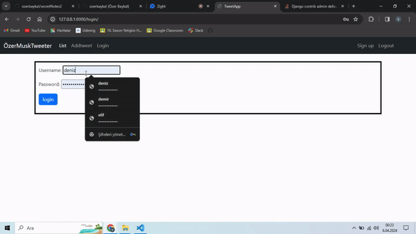

<h1>A Simple Tweet Web Application</h1>

<h2>User features</h1>

<h3>*user login, logout, signUp pages
   *Users can send tweets 
   *Only logged in users can delete their own tweets.
  
</h3>

<h3>Django library was used</h3>

<h3>Here is the application video</h3>

